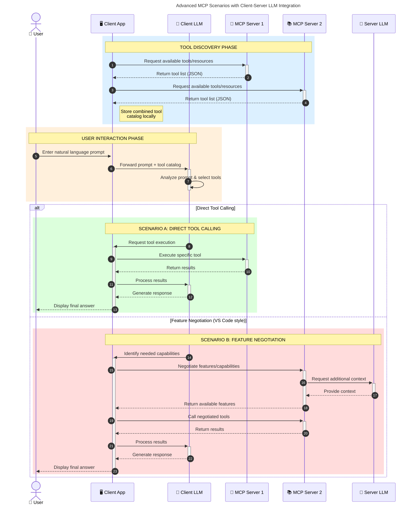

# From MCP to Agentic AI

## TO-DO

- PowerToys ZoomIt tool

Slides:

- [mcp-for-beginners](https://github.com/microsoft/mcp-for-beginners)
- [modelcontextprotocol](https://modelcontextprotocol.io/docs/getting-started/intro)

## Model Context Protocol

1. An open protocol that standardizes how applications provide context to LLMs.
2. Previously there was no standard way for LLMs to access external data and tools.
   - LLMs are limited by their training data, so they can't access real-time or organization-specific information.
   - Developers currently have to:
     - Learn and integrate each service's API.
     - Manually craft prompts to inform the LLM of available tools or data.
     - Handle orchestration between the LLM and the tools/data.
   - USB-C port for AI applications. Just as USB-C provides a standardized way to connect devices to various peripherals and accessories, MCP provides a standardized way to connect AI models to different data sources and tools abstracting away the complexity.
3. It started as a very simple standard. But better simple and to start from somewhere than complex and not used. Even when HTML paper was presented they rejected it because it was too simple.
   - This impulsed the development of the agentic AI. The ecosystem is growing fast, and it was anounced not even a year ago. Antropic the creator of Claude created the Model Context Protocol (MCP).
   - MCP is merely the vehicle for Agentic AI.
   - Agents can access your Google Calendar and Notion, acting as a more personalized AI assistant. - Generate an entire web app using a Figma design.

## MCP Core Concepts

### Participants

The key participants in the MCP architecture are:

- MCP Host: The AI application that coordinates and manages one or multiple MCP clients. The environment that integrates the model.
- MCP Client: A component that maintains a connection to an MCP server and obtains context from an MCP server for the MCP host to use. The LLM application itself (like Claude, ChatGPT, etc)
- MCP Server: A program that provides context to MCP clients.

For example: Visual Studio Code acts as an MCP host. When Visual Studio Code establishes a connection to an MCP server, like GitHub, the Visual Studio Code runtime instantiates an MCP client object that maintains the connection to the GitHub MCP server.

### Layers

- Transport Layer: Defines how messages are exchanged between MCP clients and MCP servers. The transport layer abstracts communication details from the protocol layer, enabling the same JSON-RPC 2.0 message format across all transport mechanisms. There are two transport mechanisms:
  - Stdio transport (local): Uses standard input/output streams for direct communication between local processes on the same machine, no network overhead.
  - Streamable HTTP transport (Remote): Uses HTTP POST for client-to-server messages with optional Server-Sent Events for streaming capabilities.
    - The client MUST use HTTP POST to send JSON-RPC messages to the MCP endpoint.
    - The client MAY issue an HTTP GET to the MCP endpoint.
- The data layer implements a JSON-RPC 2.0 based exchange protocol that defines the message structure and semantics. A core part of MCP is defining the schema and semantics between MCP clients and MCP servers. This layer includes:
  - Lifecycle management: Handles connection initialization, capability negotiation, and connection termination between clients and servers
  - Server features: Enables servers to provide functionalities like tools for AI actions, resources for context data, and prompts for interaction templates from and to the client
  - Client features: Enables servers to ask the client to sample from the host LLM, elicit input from the user, and log messages to the client
  - Utility features: Supports additional capabilities like notifications for real-time updates and progress tracking for long-running operations
    - Notifications: The protocol supports real-time notifications to enable dynamic updates between servers and clients. For example, when a server's available tools change—such as when new functionality becomes available or existing tools are modified—the server can send tool update notifications to inform connected clients about these changes. Notifications are sent as JSON-RPC 2.0 notification messages (without expecting a response) and enable MCP servers to provide real-time updates to connected clients.

### Primitives

MCP primitives are the most important concept within MCP. They define what clients and servers can offer each other. These primitives specify the types of contextual information that can be shared with AI applications.

MCP defines three core primitives that servers can expose:

- Tools: Executable functions that AI applications can invoke to perform actions (e.g., file operations, API calls, database queries)
- Resources: Data sources that provide contextual information to AI applications (e.g., file contents, database records, API responses)
- Prompts: Reusable templates that help structure interactions with language models (e.g., system prompts, few-shot examples)

As a concrete example, consider an MCP server that provides context about a database. It can expose tools for querying the database, a resource that contains the schema of the database, and a prompt that includes few-shot examples for interacting with the tools.

### Client Primitives

Clients:

- Sampling: Allows servers to request language model completions from the client's AI application. This is useful when servers' authors want access to a language model, but want to stay model independent and not include a language model SDK in their MCP server.
- Elicitation: Allows servers to request additional information from users. This is useful when servers' authors want to get more information from the user, or ask for confirmation of an action.
- Roots: Roots allow clients to specify which files servers can access, guiding them to relevant directories while maintaining security boundaries.
- Logging: Enables servers to send log messages to clients for debugging and monitoring purposes.

### Example workflow

MCP follows a client-server architecture where an MCP host establishes connections to one or more MCP servers. The MCP host accomplishes this by creating one MCP client for each MCP server. Each MCP client maintains a dedicated one-to-one connection with its corresponding MCP server.

Note that MCP server refers to the program that serves context data, regardless of where it runs. MCP servers can execute locally or remotely. For example, when Claude Desktop launches the filesystem server, the server runs locally on the same machine because it uses the STDIO transport.

- Uses a client-server model:
  - The AI app contains MCP clients, one for each external service.
  - Each external service has a corresponding MCP server, which speaks both MCP and the service's native API.
- Agent/Host (it is like a microservice called Host app that uses MCP client library to create instance) and Server communicates with STDIO on local or HTTP/SSE, messages in JSON/RPC. Maybe not best, or perfect, but it works and we needed standard to start with. ChatGPT/Gemini will not call the tools (maybe inside a network), but recommends to do it and the MCP client does it (maybe asks user for confirmation).

## Demo

### 1. GitHUb

Create an issue for this repository to add MCP with Azure API Management.

What is Azure API Management?

Implement the mentioned issue.

### 2. Playwright

Generate a Playwright test for the following scenario:

1. Navigate to `https://debs-obrien.github.io/playwright-movies-app`
2. search for 'Garfield'
3. verify the movie is in the list

`npx playwright install chrome`
Go to `https://www.ascent.io/data-ai` and then to find out more about Modern Platforms. Close any overlays if needed.

Generate tests for this interaction for playwright.

## Agentic AI

Semi-autonomous software that can be given a goal and will work to achieve that goal without knowing in advance exactly how it’s going  to do that or what steps it’s going to take

## Context Engineering

- The importance of Context Engineering, not only prompt engineering. Gemini can take 2M tokens of context, but after 300K it loses performance. So it is important to give the right context and not too much. This also happens if you use too many MCP servers, it can lose performance, now VS Code has a limit of 125 MCP servers tools.
- We have seen the importance of LLM like ChatGPT of being able to chose the right model for the task at hand (quick, deep, image, etc) this also happens with MCP servers, sometimes the LLM doe not know when to use a specific tool, so it is important to give the right context and not too much.

## Productionise

- Security
- Cost
- Scalability
- Monitoring
- Registries

### Security

- Not only but actors, but AI itself is dangerous. AI not deterministic, higher risk of errors, important to add test and verification (another AI or human in the loop).
- Careful with the MCP servers you install they might be malicious. Like VSCode extensions or packages. They can access your files and data.
- It uses enterprise-grade grade authentication OAuth 2.0, that will help to integrate with existing identity providers like EntraID, Okta, etc.

## Use cases

**1**
Know MCP now and for the future, it is like HTML or HTTP, you do not have to develop it, but you use it in your products and services. It is here to stay and will be used in many products and services.

The idea is to show the tool and then you can apply it to your own use cases.

**2**

- Not everything needs AI, but you need to find your own use cases. Big enterprises can benefit more from this since it has a lot of processes and data that can be automated.
- Now businesses are more aware of the potential of AI and are looking for practical applications. The field is also more mature, with more tools and frameworks available to build AI applications.
- To know the limits, features to know when it is the right case to apply it. To let users find the right use case. It is like when we got the OS, or the web, or mobile apps. We had to find the right use cases and the right way to apply it.
- Get rich by clonning VS Code or Chromium add AI and get rich. Kiro (Amazon), Trae (ByDance, TikTok) Cursor, Windsurf (Google made a soft aquicistion, bought the license and talent), and more all only forked VS Code and added AI capabilities, or Comet (Perplexity) that forked Chromium and added AI capabilities.

- [NLWeb](https://github.com/nlweb-ai/NLWeb)
- MCP on ChatGPT:
  - [Kent C. Dodds](https://www.epicai.pro/mcp-now-available-on-chatgpt-com-lbx6m)
  - [API call example](https://www.stephenwthomas.com/azure-integration-thoughts/how-to-enable-remote-mcp-servers-in-chatgpt-step-by-step-tutorial/)
- [Notion 3.0](https://www.notion.com/blog/introducing-notion-3-0)
- J.A.R.V.I.S.
- HomeAssistant
- MCP for beginners project browser automation with playwright (get content, click buttons, etc). Simple right? Imagine getting chromium and integrate this? Commet, TheBrowserCompanny, etc.
- Why so powerful? When technologies are opened to the wolrd the users applies them to their own needs and use cases, that maybe the creators did not think about. Pass the torch olympics image.

### AI and Home Assistant

- Home Assistant MCP like HAL 9000 (Heuristically programmed ALgorithmic computer) from 2001: A Space Odyssey.
- Maybe a feature where if your app does not have MCP will not be able to connect to a LLM, and maybe not able to book a table, buy a product, etc. Like the web, if you do not have HTTPS you will not be able to connect to a website. Now AI chats queries the data directly so the search engine will be less important.

### n8n

- We are closer to J.A.R.V.I.S. (Just a Rather Very Intelligent System) from Ironman.
- [N8N](https://n8n.io/) example, 130K starts on GH. New level of automation. Easier and faster to deplpoy. A lot of new products and services are being built on top of MCP, like N8N, Zapier, etc. A lot of new oppotunities.

### Try

- Encurage people to auto-generate MCP server to test for their apps and then to modify and play around with it. OpenAI specs, autogenerate and play around with it.

## Future

- Security: Midudev video Comet prompt injectying with Reddit comment
- Google wnat to give answers straightforward without sites. Sites won't got that many visits, but they might need to be integrated with MCP to buy products or services, from clients like google

- I use it everyday
- Students use it everyday we can see it during school period
- Country like USA and China are "fight" about it
- Faster, less expensive. Maybe smaller doesn't need to know specific things it can look at the internet for it

## Others

- Routing
- Context Engineering
- Asyncronous calls
- MCP Integration with Azure (Entra ID, ContainerApps/Funcions/LogicApps, Foundry, OpenAI, Azure ML, Copilot Studio). Microsoft fully engaged with MCP, one of the main contributors.

- MCP Root Contexts to mantain conversation history and shared state
- Multi-modality
- A2A (Agent to Agent) from Google
- VSCode AI toolkit

## MISC

- Show case hands on end-to-end
- Local with STDIO
- Remote
- VSCode Playwright

- [Mossaka/remote-mcp-python-demo](https://github.com/Mossaka/remote-mcp-python-demo)
- Build an app (Astro+TailwindCSS)
- [PlaywrightMCP to generate test](https://youtu.be/AaCj939XIQ4)
- [Zava-PostgreSQL-Workshop](https://github.com/gloveboxes/Unlock-your-agents-potential-with-Model-Context-Protocol-PostgreSQL-Workshop)

- [MCP Context7](https://context7.com)
- [Claude](https://claude.ai/recents)
- [MCP PythonSDK](https://github.com/modelcontextprotocol/python-sdk)

- [albarry4/IncidentResponder](https://github.com/albarry4/IncidentResponder)

### Maybe

Registries:

- Oficial:
  - [MCP Registry](https://registry.modelcontextprotocol.io/)
  - [MCP Registry GitHub](https://github.com/modelcontextprotocol/registry)
- [PulseMCP Servers](https://www.pulsemcp.com/servers), [PulseMCP Use Cases](https://www.pulsemcp.com/use-cases) and [PulseMCP server](https://mcp.so/server/pulsemcp-server)
- [MCP.so](https://mcp.so/)
- [Prompt Boost](https://promptboost.dev/)
- [Microsoft MCPs](https://github.com/microsoft/mcp)

Misc:

- [UI over MCP, Create next-gen UX](https://github.com/idosal/mcp-ui)
- [0GiS0 Miduconf](https://github.com/0GiS0/miduconf-mcp)
- [Gemini API Key](https://aistudio.google.com/app/apikey)
- [Google NotebookLM](https://notebooklm.google.com/)
- mermaid.js diagram of architecture

### Probably not

- [autogen](https://github.com/microsoft/autogen)
- [smithery.ai](https://smithery.ai/)
